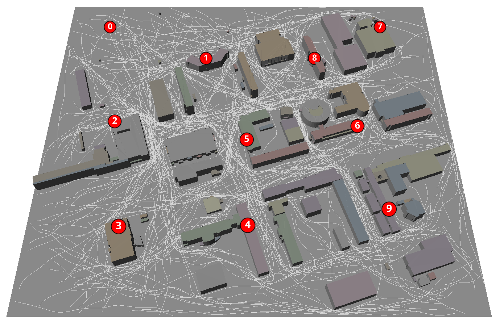

# Outdoor Dataset - MOCSID

We introduce MOCSID, a multi-cell outdoor channel state information dataset of synthetic channel state information (CSI) samples mimicking an outdoor campus scenario, including multiple base stations with partially overlapping coverage  areas and pedestrian user mobility. The scenario is characterized by a high density of base stations (10 base stations within a 625m x 535 m area) and includes a mixture of non-line-of-sight and line-of-sight propagation. MOCSID includes user locations, timestamps, velocities, and multipath component information (delays and path coefficients). The pedestrian mobility follows realistic movement patterns generated via the probabilistic roadmap algorithm. The dataset captures key propagation characteristics, including path loss, shadowing, and multipath effects. Since MOCSID is intended as a reference for the development and validation of channel charting algorithms, we put particular emphasis on the spatial consistency of the synthetic data. With this dataset, we aim to foster progress in channel charting research by facilitating entry into the field and encouraging reproducibility, collaboration, and benchmarking within the community. MOCSID was generated using the NVIDIA Sionna ray tracing tool. MOCSID is publicly released on [Zenodo](https://zenodo.org/records/14535165).


## Citation

If you use this dataset or any part of the code, please cite the accompanying [paper](https://zenodo.org/records/15294869):

> M. E. M. Makhlouf, M. Guillaud, and Y. Vindas, “Multi-cell Outdoor Channel State Information Dataset (MOCSID),” in *Proc. EuCNC & 6G Summit*, 2025.

Citaiton BibTeX:
```bibtex
@inproceedings{makhlouf2025multi,
  title={Multi-cell Outdoor Channel State Information Dataset (MOCSID)},
  author={Makhlouf, Mohamed El Mehdi and Guillaud, Maxime and Vindas, Yamil},
  booktitle={The 2025 EuCNC \& 6G Summit},
  year={2025}
}
```

<p align="center">
  
</p>

## Repository structure and files
- `requirements.txt`: Lists the dependencies required for the project.
- `coverage_map_creation.py`: Generates coverage maps based on scenario data.
- `data_generator.py`: Contains functions to generate synthetic data.
- `probabilistic_road_map.py`: Implements a probabilistic road map for trajectories generation.
- `plot_frequency_csi.py`: Plots the generated CSI in the frequency domain for any trajectory.
- `visualize_trajectories_on_scene.py`: Visualizes the generated trajectories and the scene.

- `utils_trajectories.py`: Contains functions related to trajectories smoothing and discretization.
- `utils_sionna.py`: Utilities for Sionna

- `Scenario`: A folder containing the following files related to the simulated scenario:
  - `simulation_params.json`: JSON file storing the main parameters for the simulation
   - `10000_paths_random_start_goal_no_smooth.csv`:  csv file containing 10,000 paths generated using the probabilistic road map path finder
  - `10000_paths_random_start_goal_smoothed_meta_data.csv`: A CSV file with metadata for smoothed trajectories
  - `base_stations_coordinates.csv`: csv file with coordinates of base stations in long and lat
  - `projected_base_stations_coordinates.csv`: csv file with the projected coordinates of base stations in Sionna coordinate system

  - `citi_last.xml`: Scene file in xml format compatible with sionna and mitsuba
  - `meshes`: A folder containing mesh files (.ply) used to define the scene geometry and materials
  - `cm_path_gain_tensor`: A binary file containing a serialized TensorFlow tensor representing path loss map values

## Installation instructions

We recommend creating a virtual environment (e.g., using Conda). Once your environment is set up, activate it and run the following command:

```bash
pip install -r requirements.txt
```

This command will install Sionna and other necessary libraries required for this project.

## How to regenerate the Data

From the project root directory, run the data generation script `data_generator.py`:

```bash
python data_generator.py
```

This process will take around 7 hours on NVIDIA V100 GPUs. Alternatively, you can download the pre-generated dataset from the following [link](https://zenodo.org/records/14535165).

If you prefer to generate a new dataset with custom parameters and configurations, modify the `simulation_params.json` file located in the `Scenario` folder and other related files as needed.

## Data investigation and visualization

Once you have downloaded the dataset, ensure it is placed in the `data` folder(you need to create it at the project root). Then, you can visualize the CSI frequency for selected trajectories and samples by running the `plot_frequency_csi.py` script:

```bash
python plot_frequency_csi.py
```

Additionally, the `visualize_trajectories_on_scene.py` script can produce a 3D visualization of the scene, including user trajectories:

```bash
python visualize_trajectories_on_scene.py
```

Similarly, the `coverage_map_creation.py` script can be used to reproduce and visualize path loss maps. To avoid recalculating the maps (a memory-intensive process), precomputed path loss map values are provided under the `Scenario` folder. Use the following command to load the precomputed values:

```bash
python coverage_map_creation.py --simulation_params ./Scenario/simulation_params.json --load_coverage_map --coverage_map_fn ./Scenario/cm_path_gain_tensor
```

If you want to recalculate the maps and save them, use this command:

```bash
python coverage_map_creation.py --simulation_params ./Scenario/simulation_params.json --save_coverage_map --coverage_map_fn ./Scenario/cm_path_gain_tensor
```

> **Note:** Recalculating the maps will overwrite the existing file. Use a different `--coverage_map_fn` value if you wish to preserve the current map.

## Installation troubleshooting and additional information

While running `pip install -r requirements.txt` should install most dependencies, you may encounter challenges with **Sionna**. Below are common issues and their solutions:

### Sionna installation issues

For detailed guidance, review the official [Sionna installation instructions](https://nvlabs.github.io/sionna/installation.html) and check discussions on their [GitHub repository](https://github.com/NVlabs/sionna).

### GPU support (NVIDIA GPUs Only)

To run the code on a GPU (significantly improving performance for large-scale computations), ensure the following:

1. **NVIDIA Drivers**: Install the latest NVIDIA drivers compatible with your hardware.
2. **TensorFlow with GPU Support**: Install the correct version of TensorFlow with GPU support.
3. **CUDA and cuDNN**: Ensure these libraries are installed and configured properly, as TensorFlow requires them for GPU acceleration.

### CPU support

If running the code on a CPU:

- **LLVM requirement**: DrJit (used by Sionna) requires **LLVM** for CPU execution. Ensure LLVM is installed on your system.

By following these guidelines, you should be able to resolve common installation issues and run the code seamlessly on either GPU or CPU environments.

## Acknowledgments

This dataset was generated using the [Sionna](https://nvlabs.github.io/sionna/) library [1] ray-tracing module developed by NVIDIA. We gratefully acknowledge their open-source contributions.

[1] J. Hoydis, S. Cammerer, F. Ait Aoudia, A. Vem, N. Binder, G. Marcus, and A. Keller,“Sionna: An Open-Source Library for Next-Generation Physical Layer Research,” *arXiv preprint arXiv:2203.11854*2022. Available at: [https://arxiv.org/abs/2203.11854](https://arxiv.org/abs/2203.11854)

